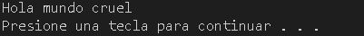
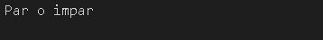
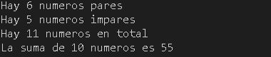
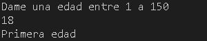
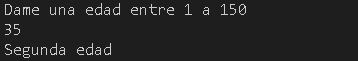
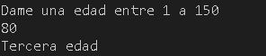
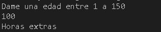
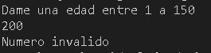
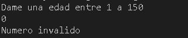

# U1 Introduccion a la Programacion

 **1.- Hola mundo**

 
<b>Descripcion:</b> Se imprime la frase Hola mundo.
 

**Codigo**

<pre>
using namespace std;

int main()
{
    cout << "Hola mundo cruel"<< endl;
    system("pause");
    return 0;
} 
</pre> 

Resultado

**2.- Pares e Impares**

 
<b>Descripcion:</b> Se imprime la frase Par o impar.
 

**Codigo**

<pre>
using namespace std;

int main()
{
    cout << "Par o impar \n"<< endl;
    return 0;
}
</pre> 

Resultado

  

 **3.- Tipos de datos**

 
<b>Descripcion:</b> Indica el tipo de dato y de cuantos bytes es.
 

**Codigo**

<pre>
using namespace std;

int main(int argc, char const *argv[])
{
    int entero =2142234;
    float flotante = 3.4e38;
    double grande = 2.32334534;
    char caracter = '@';

    cout << "Este programa muestra los tipos de datos \n";
    cout << "El numero entero es: " << entero << endl;
    cout << "El tamaño del entero es: " << sizeof(entero) << "bytes"<< endl;
    cout << "El numero del flotante es: " << sizeof(flotante) << "bytes" << endl;
    return 0;
}
</pre> 

Resultado

  

 **4.- Ciclos**

 
<b>Descripcion:</b> Se utilizan ciclos para contar pares e impares que hay entre el 1 y el 100
 

**Codigo**

<pre>
using namespace std;

int main()
{
    int n = 10;
    int suma = 0;
    int pares=0;
    int impares=0;
    int total=0;

    for (int i = 0; i <= n; i++)
    {

        
        suma = suma + i;
        if (i % 2==0){
            pares=pares+1;
        }
        else{
            impares=impares+1;
        }

        total=total+1;
    }
    printf("Hay %d numeros pares\n",pares);
    printf("Hay %d numeros impares\n",impares);
    printf("Hay %d numeros en total\n",total);
    printf("La suma de %d numeros es %d ",n,suma);
    printf("\n");

    return 0;
}
</pre> 

Resultado

  

 **5.- Edades**

 
<b>Descripcion:</b> Cuando se teclea una edad entre 1 y 150 indica si esta en la primera,segunda o tercera edad. Si pasa de la tercera edad imprimira "horas extras" y si el numero es menor a 1 o mayor a 150 dira que el numero es invalido
 

**Codigo**

<pre>
using namespace std;

int main()
{
    int edad;

    printf("Dame una edad entre 1 a 150 \n");
    scanf("%d", &edad);

    if (edad >= 1 && edad <= 150){
        if (edad >= 1 && edad <= 30){

            printf("Primera edad \n");
        }
        else if (edad >= 31 && edad <= 60){

            printf("Segunda edad \n");
        }
        else if (edad >= 61 && edad <= 90)
        {
            printf("Tercera edad \n");
        }
        else if (edad>=91 && edad<=150){

            printf("Horas extras \n");
        }  
    }
    else{

    printf("Numero invalido \n");
    }

return 0;
}
</pre> 

Resultado de primera edad

 

Resultado de segunda edad

 

Resultado de tercera edad

 

Resultado de horas extras

 

Resultados invalidos

