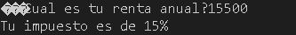
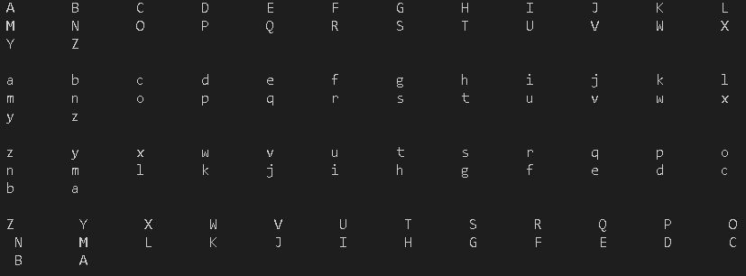
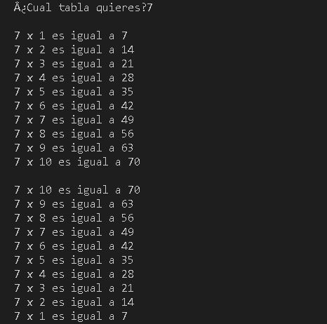
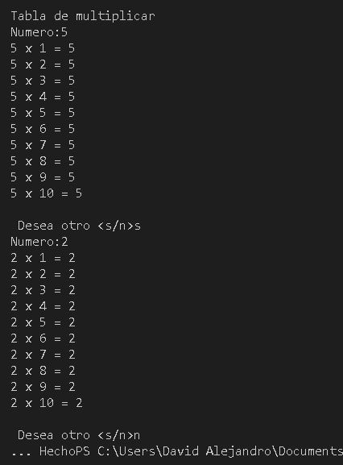
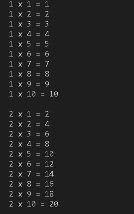
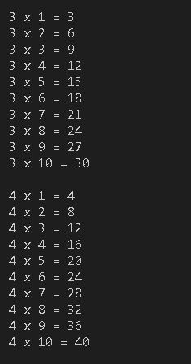
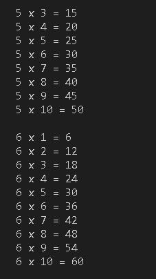
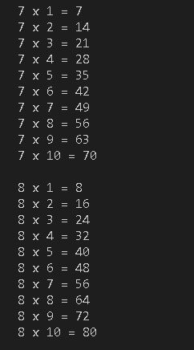
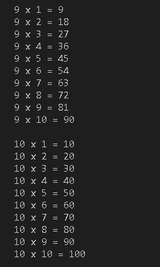

# U2 Estructuras y ciclos de control

 **<h2>01.-Rentas</h2>**

<b>Descripcion:</b> Muestra el impuesto que corresponde segun la renta anual.

**Codigo**

<pre>
using namespace std;

main(){

float renta;

printf("�Cual es tu renta anual?");
scanf("%f", &renta);

if(renta>=1){
    if (renta<10000){
        printf("Tu impuesto es de 5% \n");
    }else if (renta>=10000 && renta<20000) {
        printf("Tu impuesto es de 15% \n");
    }else if(renta>=20000 && renta<35000){
        printf("Tu impuesto es de 20% \n");
    }else if(renta>=35000 && renta<=60000){
        printf("Tu impuesto es de 30% \n");
    }else {
        printf("Tu impuesto es de 45% \n");
    }
}

}

</pre> 

**Resultado**

  
   

---

 **<h2>02.-Puntaje</h2>**

<b>Descripcion:</b> Ejercicio 2 del pdf, el cual consiste en darle su nivel y dinero ganado segun su puntuacion.

**Codigo**

<pre>
using namespace std;

int main(int argc, char const *argv[])
{
    float p;
    int n;
    printf("¿Cual es tu puntuacion? \n");
    scanf("%f",&p);
    

    if(p==0.0 || p==round(0.4) || p>=0.6)
    {
        if (p==0.0)
        {
            n=2400*0.0;
            printf("Tu nivel es Inaceptable y recibiras %d $ \n",n);
        }else if(p==0.4)
        {
            n=2400*0.4;
            printf("Tu nivel es Aceptable y recibiras %d $ \n",n);
        }else if(p>=0.6)
        {
            n=2400*p;
            printf("Tu nivel es Meritorio y recibiras %d $ \n",n);
        }
        
    }

    return 0;
}

</pre> 

**Resultado**

  
   

---

**<h2>E01.-ABC</h2>**

<b>Descripcion:</b> Imprime el abecedario en mayusculas y minusculas en orden ascendente y descendente.

**Codigo**

<pre>
using namespace std;

int main(int argc, char const *argv[])
{
    char letra= 'A';
    char letra1= 'a';
    char letra2= 'z';
    char letra3= 'Z';

    for(int i=0; i<26; i++)
    {
        printf("%c \t", letra);
        letra=letra+1;
    }
    printf("\n");
    printf("\n");
    for(int i=0; i<26; i++)
    {
        printf("%c \t", letra1);
        letra1=letra1+1;
    }
    printf("\n");
    printf("\n");
    for(int i=0; i<26; i++)
    {
        printf("%c \t", letra2);
        letra2=letra2-1;
    }
    printf("\n");
    printf("\n");
    for(int i=0; i<26; i++)
    {
        printf("%c \t ", letra3);
        letra3=letra3-1;
    }
    printf("\n");
    printf("\n");

    return 0;
}

</pre> 

**Resultado**

  
   

---

**<h2>E02.-Tablas</h2>**

<b>Descripcion:</b> Muestra las tablas de multiplicar con ciclos.

**Codigo**

<pre>
using namespace std;

int main(int argc, char const *argv[])
{
    int n;
    int r=0;
    int conti = 10;
    int cont=1;
    int a=1;
    int b=10;

    printf("¿Cual tabla quieres?");
    scanf("%d", &n);
     printf ("\n");

    for (int i=1; i<=10; i++)
    {
        r=n*i;
        printf("%d x %d es igual a %d ", n ,i, r);
        printf ("\n");
    }
     printf ("\n");
    r=0;

    for (int j=10; j>=1; j--)
    {
        r=n*j;
        printf("%d x %d es igual a %d ", n ,j, r);
        printf ("\n");
    }
    r=0;

    printf ("\n");

    while (cont<=10)
    {
        r=n*cont;
        printf("%d x %d es igual a %d ", n ,cont, r);
        printf ("\n");
        cont=cont+1;
    }

     printf ("\n");

    while (conti>=1)
    {
        r=n*conti;
        printf("%d x %d es igual a %d ", n ,conti, r);
        printf ("\n");
        conti=conti-1;
    }

    printf ("\n");

    do{
        r=n*a;
        printf("%d x %d es igual a %d ", n ,a, r);
        printf ("\n");
        a=a+1; 
    }while (a<=10);

    printf ("\n");

    a=10;
    do{
        r=n*a;
        printf("%d x %d es igual a %d ", n ,a, r);
        printf ("\n");
        a=a-1; 
    }while (a>=1);
    

    return 0;
}

</pre> 

**Resultado**

  
   

---

**<h2>E03.-CicloWhile</h2>**

<b>Descripcion:</b> Muestra la tablas de multiplicar pedidas y te pregunta si quieres otra tabla de multiplicar.

**Codigo**

<pre>
using namespace std;

int main(int argc, char const *argv[])
{
    int n, i;
    char opcion='s';
    printf ("Tabla de multiplicar \n");

    while (opcion=='s')
    {
        printf("Numero:");
        scanf("%d", &n);

        i= 1;
        do
        {
            printf("%d x %d = %d \n", n,i,n*1);
            i++;
        } while (i<=10);
        

        printf("\n Desea otro <s/n>");
        scanf("%s", &opcion);

    }
    printf("... Hecho");
    return 0;
}
</pre> 

**Resultado**

  
   

---

 **<h2>E04.-ForFor</h2>**

<b>Descripcion:</b> Imprime las tablas del 1 al 10 completas mediante el uso de un for.

**Codigo**

<pre>
using namespace std;

int main(int argc, char const *argv[])
{
    int r=0;

    for (int i =1; i<=10; i++)
    {
        for(int j =1; j<=10; j++)
        {
            r=i*j;
            printf("%d x %d = %d",i,j,r);
            printf("\n");
        }
    
        printf("\n");
    }
    return 0;
}
</pre> 

**Resultados**

  
 
  
 
  
 
  
 
  

---

