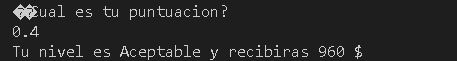
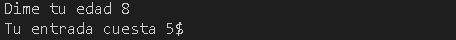
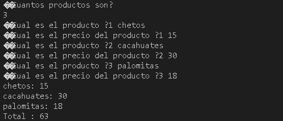

# U2 Estructuras y ciclos de control

**<h2>01.-Rentas</h2>**

<p><b>Descripcion:</b> Programa que pide al usuario su renta anual y le muestra cual es el impuesto que debe pagar.</p>

**Codigo**
```c++
using namespace std;

main(){

float renta;

printf("�Cual es tu renta anual?");
scanf("%f", &renta);

if(renta>=1){
    if (renta<10000){
        printf("Tu impuesto es de 5% \n");
    }else if (renta>=10000 && renta<20000) {
        printf("Tu impuesto es de 15% \n");
    }else if(renta>=20000 && renta<35000){
        printf("Tu impuesto es de 20% \n");
    }else if(renta>=35000 && renta<=60000){
        printf("Tu impuesto es de 30% \n");
    }else {
        printf("Tu impuesto es de 45% \n");
    }
}

}
```

**Resultado**

 
<br> 
   
<br>  

---

 **<h2>02.-Puntaje</h2>**

<p><b>Descripcion:</b>Programa que pide el puntaje y imprime el desempeño y el pago que recibira el usuario. </p>

**Codigo**

```c++
using namespace std;

int main(int argc, char const *argv[])
{
    float p;
    int n;
    printf("¿Cual es tu puntuacion? \n");
    scanf("%f", &p);

    if (p == 0.0f || p == 0.4f || p >= 0.6f)
    {
        if (p == 0.0f)
        {
            n = 2400 * 0.0f;
            printf("Tu nivel es Inaceptable y recibiras %d $ \n", n);
        }
        else if (p == 0.4f)
        {
            n = 2400 * 0.4f;
            printf("Tu nivel es Aceptable y recibiras %d $ \n", n);
        }
        else if (p >= 0.6f)
        {
            n = 2400 * p;
            printf("Tu nivel es Meritorio y recibiras %d $ \n", n);
        }
    }

    return 0;
}
```
<br>

**Resultado**

  
  
<br>  

---

**<h2>E03.-Salas</h2>**

<p><b>Descripcion:</b> Programa que pide la edad del usuario le muestra el precio de su entrada. </p>

**Codigo**

```c++
using namespace std;
int main(){
    int edad;
    printf("Dime tu edad ");
    scanf("%d", &edad);

    if (edad<4)
    {
        printf("Tu entrada es gratis \n");
    } else if (edad>=4 & edad<=18 )
    {
        printf("Tu entrada cuesta 5$ \n");
    }else if (edad>18 )
    {
        printf("Tu entrada cuesta 10$ \n");
    }
    return 0;
}
```
<br>

**Resultado**

  
  
<br>  

---

 **<h2>E04.Pizzeria</h2>**

<p><b>Descripcion:</b> Programa que pide al usuario si quiere pizza vegetariana o normal, al final le imprime al usuario todos los ingredientes de su pizza</p>

**Codigo**

```c++
using namespace std;

int main(int argc, char const *argv[])
{
   string t = "";
   string i = "";
   cout << "¿Quieres una pizza vegetariana?" << endl;
   cin >> t;

   if (t == "si")
   {
      cout << "Los ingredientes son: pimiento y tofu \n ¿De que quieres tu pizza?";
      cin >> i;
      if (i == "pimiento")
      {
         cout << "Su pizza es vegetariana y contiene mozarella, tomate y pimiento.";
      }
      else if (i == "tofu")
      {
         cout << "Su pizza es vegetariana y contiene mozarella, tomate y tofu." << endl;
      }
   }
   else if (t == "no")
   {
      cout << "Los ingredientes son: peperoni, jamon y salmon \n ¿De que quieres tu pizza?";
      cin >> i;
      if (i == "peperoni")
      {
         cout << "Su pizza es vegetariana y contiene mozarella, tomate y peperoni." << endl;
      }
      else if (i == "jamon")
      {
         cout << "Su pizza es vegetariana y contiene mozarella, tomate y jamon.";
      }
      else if (i == "salmon")
      {
         cout << "Su pizza es vegetariana y contiene mozarella, tomate y salmon.";
      }
   }

   return 0;
}
```

**Resultados**

  
<br>
  
<br>
  

---

**<h2>E05.-Temperaturas</h2>**

<p><b>Descripcion:</b> Programa que pide 6 temperaturas y indica cual es la mayor y la menor.</p>

**Codigo**

```c++
using namespace std;

int main(int argc, char const *argv[])
{
    int t[5];
    int p=0, pf , a=0, b=0, n;

    cout << "Dame 6 temperaturas" << endl;
    for (int i = 0; i <= 5; i++)
    {
        cout << "Dime la temperatura " << i << " " ;
        cin >> t[i];
        p=p+t[i];
        
    }

    a=t[0];
    b=t[0];

    for (int i = 0; i <=5; i++)
    {
          if (t[i]>=a)
        {
            a=t[i];
        }else if (t[i]<b) 
        {
            b=t[i];
        }
    }
    

    pf=p/6;
    cout << "El promedio es: " << pf<< endl;
    cout << "El mayor es: " << a << endl;
    cout << "El menor es: " << b << endl;
    return 0;
}
```

**Resultados**

  
<br>

---

**<h2>E06.-Productos</h2>**

<p><b>Descripcion:</b> Programa que pide cantidad de productos, con su nombre y su precio y al final lo imprime.</p>

**Codigo**

```c++
using namespace std;

int main(int argc, char const *argv[])
{

    int tp, t;
    int costos[tp];
    string productos[tp];

    cout << "¿Cuantos productos son?" << endl;
    cin >> tp;

    for (int i = 0; i<=tp-1; i++)
    {
       cout << "¿Cual es el producto ?" << i+1 << " ";
       cin >> productos[i];

       cout << "¿Cual es el precio del producto ?" << i+1 << " ";
       cin >> costos[i];

        t=t+costos[i];
    }

    for (int i = 0; i <= tp-1; i++)
    {
        cout << productos[i] << ": " << costos[i] << endl; 
    }
    
    cout << "Total " << ": " << t << endl;
    

    return 0;
}
```

**Resultados**

  
<br>
  
<br>
  

---

**<h2>E07.-Decimal a binario</h2>**

<p><b>Descripcion:</b> Programa que convierte un numero decimal a binario.</p>

**Codigo**

```c++
using namespace std;
int main()
{
    int n;
    string b = "";
    cout << "Introduzca un número ";
    cin >> n;
    if (n > 0)
    {
        while (n > 0)
        {
            if (n % 2 == 0)
            {
                b = "0" + b ;
            }
            else
            {
                b = "1"+b ;
            }
            n = n / 2;
        }
    }
    cout << "El resultado es: " << b << endl;

    return 0;
}
```

**Resultados**

  
<br>
  
<br>
  

---