# U3 Functions

**<h2>01.-Bisection</h2>**

<p><b>Description:</b> This program getsg bhy the square roots from the ecuation.</p>

**Code**
```c++
#include <iostream>
#include <cmath>

using namespace std;

double fnEcuacion1(double x)
{ // x^2-8x+15
    double y;
    y = pow(x, 2) - 8 * x + 15;
    return y;
}

int main()
{
    double x1=4;
    double x2=7;
    double xm;
    double es=.00000001; //Error absoluto
    double er=abs(x2-x1); //Error relativo

    int i=1;
    while (er > es)
    {
        xm=(x1+x2)/2;
        if ((fnEcuacion1(x1)*fnEcuacion1(xm))<0)
        {
            x2=xm;
        }else 
        {
            x1=xm;
        }
        er=abs(x2-x1);
        i=i+1;
    }
    
    cout << xm << endl;
    cout << "Se corrio " << i << " veces" << endl;
    return 0;
}

```

**Result**

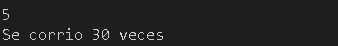 
<br> 


---

 **<h2>02.-Leap-year</h2>**

<p><b>Description:</b>This program indicates if the year is a leap year or not. </p>

**Coode**

```c++
#include <iostream>
#include <math.h>
using namespace std;


bool esBisiesto(int año){
    if (año%400==0 || ( año%4==0 && año%100!=0 )){
        return true;
    }else{
        return false;
    }
}

int main(int argc, char const *argv[])
{
    int a;
    cout << "Dame un año" << endl;
    cin >> a;

    if (esBisiesto(a)==true){
        cout << "El año es bisiesto \n" << endl;
    }else {
        cout << "El año no es bisiesto \n" << endl;
    }
    return 0;
}

```
<br>

**Result**

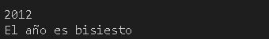  
<br>
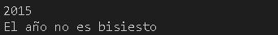  
<br>  

---

**<h2>E03.-Coseno function</h2>**

<p><b>Description:</b> This program calculates coseno function of an angle.</p>

**Code**

```c++
#include <iostream>
#include <math.h>
using namespace std;

#define n 6
#define PI 3.14159265358979323846

double g2r(double grados){
    return grados * PI/180;
}

long double factorial (int num)
{
    long double ft=1.0;

    for (int i=1; i<=num; i++){
        ft=ft*i;
    }
    return ft;
}

double cos(double x){
    double r=0;
    for (int i = 0; i <= n; i++)
    {
        r=r+(pow(-1, i)*((pow(x, 2*i))/factorial(2*i)));
    }
    
    
    return r;
}

int main(int argc, char const *argv[])
{

    
    double angulo=g2r(60), res;
    res=cos(angulo);
    cout << res << endl;

    return 0;
}
```
<br>

**Results**

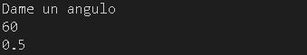  
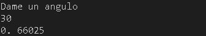  
<br>  

---

 **<h2>E04.-Standard deviation</h2>**

<p><b>Description:</b> This program calculates the standard deviation of a population and of sample.</p>

**Code**

```c++
#include <iostream>
#include <math.h>
using namespace std;

#define nd 5

double resta(double num, double media){
    double res=pow(num-media,2);
    return res;
}

void llenarVres(double res[], int numd, double datos[], double med){
    for (int i = 0; i < numd; i++)
    {
        res[i]=resta(datos[i], med);
    } 
}

double promedio(double datos[nd],int numd){
    int promedio=0;
    for ( int i = 0; i < numd; i++)
    {
        promedio=promedio+datos[i];
    }
    
    return promedio/numd;
}

double sum(double res[], double sumatoria,int numd){

    for (int i = 0; i < numd; i++)
    {
        sumatoria=sumatoria+res[i];
    }
    
    return sumatoria;
}


int main(int argc, char const *argv[])
{
    double datos[]={600, 470, 170, 430, 300};
    double media=promedio(datos, nd);
    double res[nd];
    double sumatoria, des, desm;

    llenarVres(res, nd, datos, media);
    sumatoria=sum(res, sumatoria, nd);
    des=sqrt(sumatoria/nd);
    desm=sqrt(sumatoria/(nd-1));

    cout << "Desviacion estandar poblacional: " << des <<  endl;
    cout << "Desviacion estandar de la muestra: " << desm <<  endl;
    
    
    return 0;
}
```

**Results**

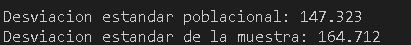  
<br>


---

**<h2>E05.-Currrency breakdown</h2>**

<p><b>Description: </b> This program after entering an amount, indicates how many bills and coins will recive in exchange.</p>

**Code**

```c++
#include <iostream>
#include <math.h>
using namespace std;

#define n 10

void comprobacion(int monto[], int dinero, int res[]){
    for (int i = 0; i < n; i++)
    {
        if(dinero/monto[i]>=1){
            res[i]=dinero/monto[i];
            dinero=dinero%monto[i];
        }else{
            res[i]=dinero/monto[i];
            dinero=dinero%monto[i];
        }
    }
}

int main(int argc, char const *argv[])
{
    int dinero;
    int monto[]={1000,500,200,100,50,20,10,5,2,1};
    string valores[]={"1000", "500", "200", "100","50","20","10","5","2","1"};
    int res[n];

    cout << "Dame un monto" << endl;
    cin >> dinero;
    comprobacion(monto,dinero,res);

    for (int i = 0; i < n; i++)
    {
        cout << valores[i] << " : " << res[i] << endl;
    }
    

    return 0;
}
```

**Results**

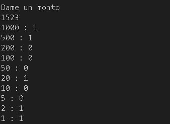  
<br>
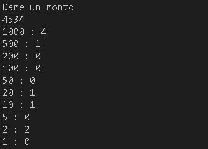  
<br>

---

**<h2>E06.-Roman numbers</h2>**

<p><b>Description:</b> This program converts arabic numbers to roman numbers.</p>

**Code**

```c++
#include <iostream>

using namespace std;

int main(){
	while(1){
		int numero,unidades,decenas,centenas,millares;
		
		cout << "\nIngresa un numero entre [1-3999] para convertirlo a romano: ";
		cin >> numero;
		
		unidades = numero%10; numero /= 10;
		decenas = numero%10; numero /= 10;
		centenas = numero%10; numero /= 10;
		millares = numero%10; numero /= 10;
		
		switch(millares){
			case 1: cout << "M"; break;
			case 2: cout << "MM"; break;
			case 3: cout << "MMM"; break;
		}
		
		switch(centenas){
			case 1: cout << "C"; break;
			case 2: cout << "CC"; break;
			case 3: cout << "CCC"; break;
			case 4: cout << "CD"; break;
			case 5: cout << "D"; break;
			case 6: cout << "DC"; break;
			case 7: cout << "DCC"; break;
			case 8: cout << "DCCC"; break;
			case 9: cout << "CM"; break;
		}
		
		switch(decenas){
			case 1: cout << "X"; break;
			case 2: cout << "XX"; break;
			case 3: cout << "XXX"; break;
			case 4: cout << "XL"; break;
			case 5: cout << "L"; break;
			case 6: cout << "LX"; break;
			case 7: cout << "LXX"; break;
			case 8: cout << "LXXX"; break;
			case 9: cout << "XC"; break;
		}
		
		switch(unidades){
			case 1: cout << "I"; break;
			case 2: cout << "II"; break;
			case 3: cout << "III"; break;
			case 4: cout << "IV"; break;
			case 5: cout << "V"; break;
			case 6: cout << "VI"; break;
			case 7: cout << "VII"; break;
			case 8: cout << "VIII"; break;
			case 9: cout << "IX"; break;
		}
		
	}
	return 0;
}
```

**Results**

  
<br>
  

---

**<h2>E07.-RFC</h2>**

<p><b>Description:</b> This program gets RFC of the user.</p>

**Code**

```c++
#include<stdio.h> 
#include<string.h>
#include <iostream>

using namespace std;

main(){
char apellidoP[100], apellidoM[100], Nombre[100], rfc[100], year[100]; 
    cout<<"Ingresa el apellido paterno"<<endl; 
    cin>>apellidoP; 
    cout<<"Ingresa el apellido materno "<<endl; 
    cin>>apellidoM; 
    cout<<"Ingrese solo su primer nombre "<<endl; 
    cin>>Nombre; 
    cout<<"Ingresa tu fecha de nacimiento"<<endl;  
    cin>>year; 
     
    rfc[0] = apellidoP[0]; 
    rfc[1] = apellidoP[1];
    rfc[2] = apellidoM[0]; 
    rfc[3] = Nombre[0]; 
    strcat(apellidoP, apellidoM);
    strcat(apellidoM, Nombre);
    strcat(Nombre, year);

    cout<<rfc<<year<<endl;

    return 0;
}
```

**Results**

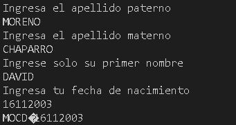  
<br>

  

---
**<h2>E08.-Sort a vector / bubble method</h2>**

<p><b>Descripcion:</b> This program sorts a vector ascending.</p>

**Code**

```c++
#include<iostream>
using namespace std;

//Vector ordenado a porel metodo de burbuja de forma ascendentemente
void llenar(int V[], int n){
    for (int i = 0; i < n; i++)
    {
        cout << "Ingresa el valor "<< i <<endl;
        cin >> V[i];
    }
    
}

int main(int argc, char const *argv[])
{
    int n;
    cout << "¿Cuantos numeros quieres en el vector?"<<endl;
    cin >> n;
    int V[n];
    llenar(V, n);

    for (int i = n-1; i >=0; i--)
    {
        for (int j = 0; j < i ; j++)
        {
            if(V[j]<V[j+1])
            swap(V[j], V[j+1]);
        }
              
    }
    cout << "Vector ordenado ascendentemente" << endl; 
    for (int i=n-1; i>=0; i--)
    {
        cout << V[i] << endl;
    }
    
    
    return 0;
}
```

**Results**

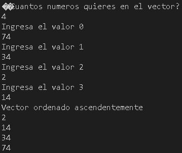  
<br>
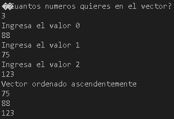  
<br>

---
**<h2>E09.-Recursive function</h2>**

<p><b>Description:</b> This program makes a function that calls itself.</p>

**Code**

```c++
#include <iostream>  
using namespace std;
long long factorial(long long n)
  {
     if(n==1 || n==0)   // condición de parada
         return 1;
      return n * factorial(n - 1);   // Llamada recursiva a la función y condición de parada
  }
int main()
  {
     int n; 
     cin >> n; 
     cout<< "factorial de  "<< n <<" es " << factorial(n) << endl;
     return 0;
  }
```

**Resuls**

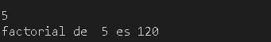  
<br>
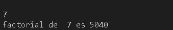  
<br>
  

---